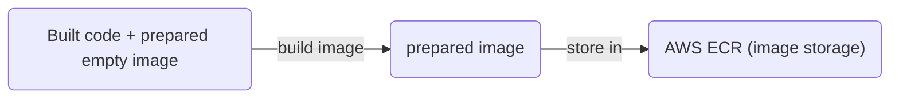
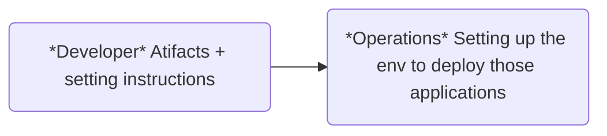
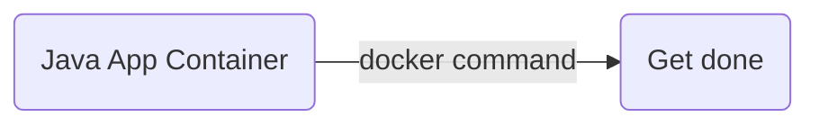

# Study Docker

## Flows

## Attributes

- Own isolated env

## Adavantages

1. E.g. To set up 10 JS applications only needs 10 times docker commands, does not need set up each by each
2. Run the same app with 2 different versions

## Before Containers vs After Containers

Before:

After:

## Q/A

Q: What is a Container?

A: 

- We can start multiple container from 1 single image
- Layers of images: E.g. Linux base image alpine + application image postgres  on top of it
- A way to package application with all the necessary dependencies and configuration
- Protable artifact, easily shared and moved around 

Q: Where do cantainers live?

A: Container repository (public: Docker Hub)

Q: Docker vs Virtual Machine

A:

| Docker | Virtual Machine |
| ------ | --------------- |
| Virtualize applications layer| Virtualize both applications layer and OS Kernel |
| small size | big size |
| limit on OS | limitless on OS|

## Commands

E.g.

- `docker run postgres:9.6`

| Command | Description |
| -------| ------------ | 
| `docker ps` | See all running docker containers |
| `docker images` | See images |
| `docker run -d <image>` | Run docker at the background (detached) |
| `docker run -p <port of host:port of container> <image>` | `-p`: bind ports |
| `docker start <ID or name of the container>` | Start the container |
| `docker stop <ID or name of the container>` | Stop the container |
| `docker pull <image>:<tag>` | pull image from internet |
| `docker exec -it <container_name or _id> [/bin/sh | psql -U <USER_NAME>]` | Run commands in the container, `-it:` interactive TTY session |
| `docker logs <container_name or _id> ` | logs in container |

## References

1. [TechWorld with Nana; Docker Tutorial for Beginners [FULL COURSE in 3 Hours] (2020.10)](https://youtu.be/3c-iBn73dDE)
