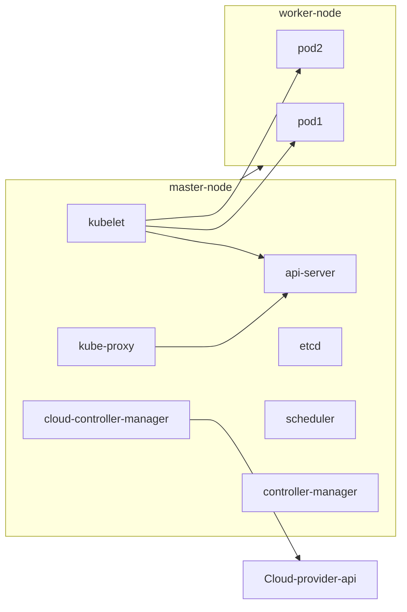

# Study Kubernetes

- 更方便管理 containers => scaling...
- a node is a VM (?) a like-EC2?

K8s cmomponents contains two parts

- Worker Node: Run contained applications
  - Kubelet agent: make sure containers run inside pods
  - Container runtimes such as Docker, containerd, CRI-O
  - Kube-proxy: maintain network rules, allow communication with pods
- Master Node (control plane): manage the work node and pods of the cluster
  - etcd: backing store for all cluster data



---

Install with Homebrew on macOS

```
brew install kubectl
```

Update AWS EKS

```
KUBECONFIG=~/.kube/<name of kube-config> aws eks update-kubeconfig --region <region> --name <name>
```

> May need extra values in kube config file to get authorized

## Advandtages

1. Dynamic scaling: Detect traffic and automatically increase computation resources
2. Self Healing: Rebuild broken app
3. Zero-downtime rolling udpate: When deploying a new verion, the user will not feel about it (system never turns down)
3. Zero-downtime rollback: When downgrading a verion, the user will not feel about it (system never turns down)

## Usage

> Copying `kube-config` into `./kube/config` (config is a file) can ignore prefix `KUBECONFIG=~/.kube/<name of kube-config>`

Get namespace

```
KUBECONFIG=~/.kube/<name of kube-config> kubectl get namespace
```

Get pod

```
KUBECONFIG=~/.kube/<name of kube-config> kubectl get pod -n <namespace>
```

### Get logs of pod

```
KUBECONFIG=~/.kube/<name of kube-config> kubectl logs <pod> -n <namespace>
```

---

**Better solution with stern**

```
KUBECONFIG=~/.kube/<name of kube-config> stern <pod-prefix> -n <namespace>
```

> `brew install stern`

It improves

1. prefix searching (random names of a pod issue + one system multiple pods issue)
2. auto update logs (no need re-run commands)

---

**Better solution with stern + kubectx + config file**

```
// show all contexts (in config file)
kubectx

// switch to specific context (no need to set namespace anymore)
kubectx <context>
```

and easily

```
stern <pod-prefix>
```

## Other Commands

```
kubectl get deployment <pod> -o yaml
```

## Useful aided Tools

- stern
- kubectx

## References

1. [Kubernetes (K8S) 解決了什麼問題？【四大功用】(2023.01)](https://youtu.be/irf95K4N-1g)
