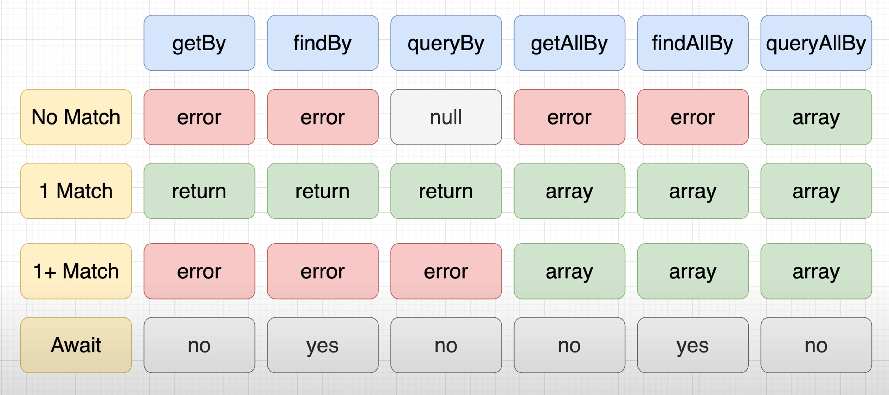

# Study React Testing Library

1. A testing file is usually named `<Component>.test.js`. E.g. `App.test.js`

## In Test Block

1. Render a component to test
2. Find elements we want to interact with
3. Interact with those elements
4. Assert that results are as expected

Test function:

```javascript
test('what you what to name', () => {});
or
it('what you what to name', () => {});
```

## APIs

`render`: Render an Component into virtual DOM

`screen`: 

```javascript
screen.getByText(/XXXXX/i);
```

`fireEvent`: Trigger event

```javascript
// E.g.
const inputElement = screen.getByPlaceholderText(/Add a new task here/i);

// trigger type event
fireEvent.change(inputElement, { target: { value: "Go shopping"} });
expect(inputElement.value).toBe("Go shopping");
```

### Methods

1. `ByRole`: heading, button..
2.  

## Tips

1. 大多數時候都用 `get` 而非 `find` 或者 `query`


*https://www.youtube.com/watch?v=Yghw9FkNGsc&list=PL4cUxeGkcC9gm4_-5UsNmLqMosM-dzuvQ&index=5*

```javascript
// find example (async)
test('render same text passed into title prop', async () => {
  // render Header into virtual DOM
  render(<Header title={"MY HEADER"} />);
  const headingElement = await screen.findByRole("heading", { name: "MY HEADER"});
  expect(headingElement).toBeInTheDocument();
});
```

## Descirbe Block

```javascript
describe('Your Description', () => {});
```

## Before and After Each

```javascript
beforeEach(() => {console.log("Running before each test");});

beforeAll(() => {console.log("Running once before all tests");});

afterEach(() => {console.log("Running after each test");});

afterAll(() => {console.log("Running once after all tests");});
```

### afterEach();

```javascript
// clean up after each test (all tests from the same start poi)
afterEach(() => {
  cleanup();
});
```

## Mock Service Worker

`yarn add msw --dev`

## References

1. https://testing-library.com/docs/react-testing-library/intro/
2. [Laith Harb; React Testing Library Tutorial (2021)](https://www.youtube.com/playlist?list=PL4cUxeGkcC9gm4_-5UsNmLqMosM-dzuvQ)
3. https://mswjs.io/

